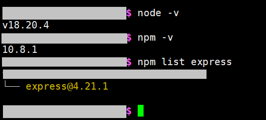
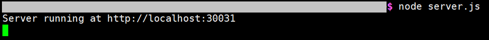

# Why this project?

This Node.js project allows a server to update and retrieve dynamic IP addresses, port numbers, or any other text-based data via simple web requests. Users can easily automate the process with scripts to periodically fetch or update this data.

Suppose that a server changes to a new random IP address every 24hr, then the server can change a stored value on a web server by just visiting a special URL through a script. Then, those who want to visit this server can have a script to visit a different URL to retrieve the stored text on this web server for later uses (for example, the stored text may be "8.8.8.8:30031"). Usually the retrieval scripts will be set to be automated, running every hour or day.

# How to use

It can be accessed via a web browser or the command line (e.g., using curl) (automation with Shell scripts). 

## How to use on browser page

Visiting the URL with the port number to the server will display the stored content in plain text on the browser page (eg. visiting http://\<your-server-domain\>.com:30031 on the browser). 

To update the stored content, append a special variable to the URL. Say if we want to change the content to be the text "NewContent", we can visit "http://\<your-server-domain\>.com:30031/stored-text=NewContent". The "stored-text" is the variable name here. The variable name can be customized by changing 'stored-text' on line 25 of server.js (app.get('/**stored-text**=:newText', (req, res) => {...})

## How to use on command line

1. returns the text (replace with actual **Domain URL** and **Port Number**)

    curl http://\<your-server-domain\>.com:30031
   
2. updating the text to "8.8.8.8:1000" or "abc"

    curl http://\<your-server-domain\>.com:30031/stored-text=8.8.8.8:1000
   
    curl http://\<your-server-domain\>.com:30031/stored-text=abc

# How to deploy

1. Check if your server had installed Node.js, NPM (package manager for Node.js packages), and the Express package with the following commands in command line:

```Shell
$ node -v
$ npm -v
$ npm list express
```


You can install Node.js from the [Node.js official website](http://nodejs.org/en) (installing Node.js will usually come with npm already).

As for installing the Express package:

```Shell
$ npm install express
```

2. Make a project folder if you do not have one yet, and navigate into it. While inside the project folder, use the below init command to initialize the Node.js project. 

```Shell
# a reminder for not using root user to create a folder
$ mkdir my-project
$ cd my-project
$ npm init -y
```

3. Copy and paste the server.js file into the project folder. 

4. (**important!**) Customize the server.js file as needed. You may want to customize the port number (line 4) and the variable name in the URL (line 25) in server.js.

You may want to change the port number if the default 30031 port is already in use. The reason why I chose 30031 is only because larger port numbers tend to be unused, and so I chose a large number at random. To change the port number, edit line 4 of server.js

You may also want to change the variable name in the url. By default, the variable name is "stored-text", and is used in a link like "http://\<your-server-domain\>.com:30031/stored-text=abc". To change to something else, say like "randomText", change line 25 of server.js like such:

```js
// before change
app.get('/stored-text=:newText', (req, res) => {...})
// after change
app.get('/randomText=:newText', (req, res) => {...})
```

Then the new link will be "http://\<your-server-domain\>.com:30031/randomText=abc". 

5. While inside the project folder, run in the command line:

```Shell
$ node server.js
```


Congratulations, the program is now running. The server will listen to port 30031 by default. 


# Notes

**Text storage:** The program will create a txt file in the same directory to store the text when it receives a url that tells it so. It will overwrite the contents of the txt file if the file already exists. 

**Program attached to foreground:** The running program is attached to the current terminal, meaning that if you close the terminal, or close the SSH connection page, the the program will stop running. If you would like it to keep running in the background, you may want to use the following linux bash command:

```Shell
# nohup command (no hang up command, the program starts running from the background, and continues to run even after you log out or close the terminal) (cannot be used when the program is already running)
$ nohup node server.js &> /dev/null &
```

The "> /dev/null &" means ~~dump~~ redirect stdout and stderr to ~~trash can~~ /dev/null. 

Note that this program is currently "rogue", meaning you do not have immediate control over it now, and closing the terminal no longer terminates the program. You cannot terminate the program like the usual "ctrl + c" method, you can no longer interact with it in the terminal, and it will keep running and keep occupying that port until you use commands to kill its process, or that the machine is poweroffed or restarted. 

On a side note, to attach a rogue process to the current terminal, search up the command "reptyr pID". "reptyr pID" will grab the process with id pID and attach it to your current terminal.

To terminate the program without having to poweroff the machine, you will need to use commands. Search in Google for the key words "find pid by port number" and "kill a process by pid" for more details. 

```Shell
# look for a process that is using the port 30031
$ lsof -i :30031
# kill the process with process id of pID, "-9" denotes kill it even if it is unresponsive
$ kill -9 pID
```

Below are additional information of the more elegent solutions to having the program run in the background. They give more utility, but the commands are more complex and requires research on the web. 

There is a command called ["tmux"](https://github.com/tmux/tmux/wiki). Its a project on Github, and using it allows for creating fake terminal sessions. As long as the machine doesn't poweroff or retart, the sessions will persist to make the program think they are still in the foreground of a terminal. You may find this [Cheat Sheet](https://tmuxcheatsheet.com/) helpful if you are interested in using it. 

The Linux service ["systemd"](https://systemd.io/) and the tool ["supervisord"](https://github.com/ochinchina/supervisord) provide even more utility. The most notable thing is the service for automatically starting all registered services once the machine powers on. The utilities they provide are almost a must for enterprise level projects. "systemd" is usually a built-in function that requires being root user(admin account/super user) to use it, no need for installing (and because it is a built-in, you can't even install it if it's missing). However, you may encounter situations like not having access to root, missing "systemd", etc. Then you can use the Github project "supervisord", which is a reimplementation of the "systemd" functions, and it is installable. Check out the manuals for ["systemd"](https://systemd.io/) and ["supervisord"](http://supervisord.org/) for more details. 


